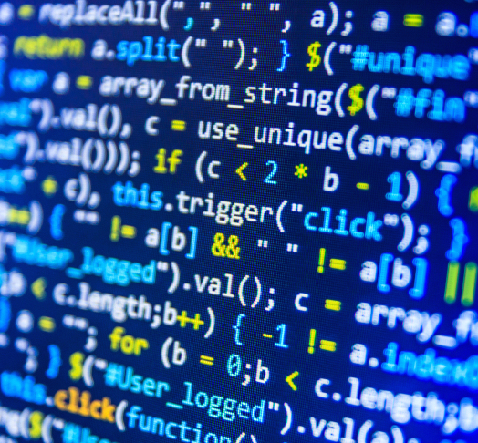

## Following the Trend

I've been trying to get myself to learn Javascript for a while now, especially because I take great interest in becoming a proficient web developer, so having it as a topic for my ICS 314 class at the University of Hawaii is enjoyable so far. I've learned and developed projects in both Java and C++, so learning the Javascript syntax and basics was pretty easy, since it's very similar. However, there are ways that Javascript differs from Java and C++, and has proven to be more powerful in certain areas. Javascript is a flexible programming language and has become the standard for web developers everywhere. It's trend of use and popularity in the professional world of programming shows no signs of slowing down. For this reason, I believe learning this language and putting it into practical use is essential to becoming a well-rounded software engineer. From a software engineering perspective, Javascript is a great langauge to know and master.

## The Road Less Travelled

In my ICS 314 class, Professor Philip Johnson introduced a new way to learn and practice software development - Athletic Software Engineering. This method of learning involves what are known as WODs, or Workouts of the Day. These exercises consist of coding problems that are timed to push the class to program efficiently and accurately while under pressure. So far, we have only done one official WOD in class, but have been given a few practive WODs to do at home, too. Over the course of the semester, as we do more and more of these WODs, I believe I will not only become a better programmer, but also a faster one. 

Philip Johnson, an ICS professor at the University of Hawaii who coined this idea of "athletic software engineering," stresses that this method of teaching transforms students into fluent, multi-tasking, and efficient programmers who would be better prepared for hackathon and weekend startup environments. These skills are impossible to learn overnight.  It takes time. It takes practice. It takes training to be an athletic software engineer, and I am excited to be a part of the process.

To learn more about athletic software engineering, read Philip Johnson's essay about it <a href="http://philipmjohnson.org/essays/athletic-software-engineering.html">here.</a>

