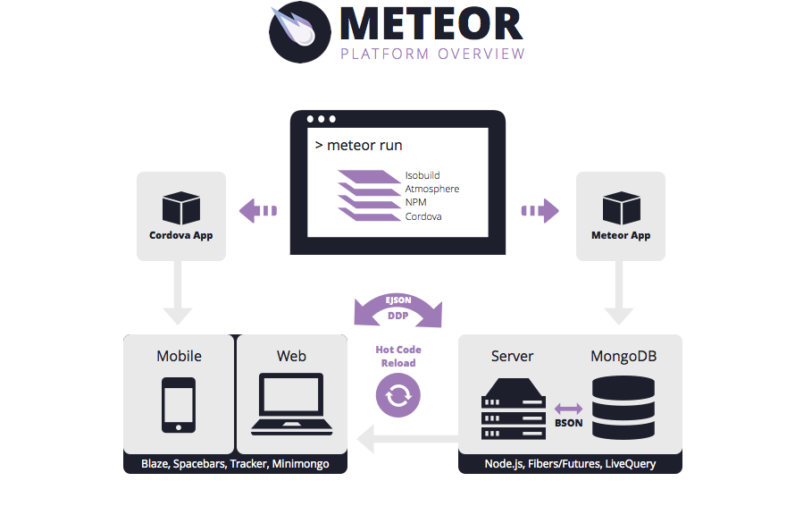

## Not Your Typical Meteor

Everything I've been learning in the past few months - JavaScript, HTML, CSS, Git/Github, were all brought together in these past couple of weeks once I dipped my toe in Meteor. No, not the piece of rock that glows as it falls from outer space into the earth's atmosphere. This Meteor is a modern, internet-based, client-server application architecture. And let me tell you, learning it can be a daunting task.

## The Struggle

My experience learning Meteor started by watching several getting started tutorials, showing me the concept of Meteor and how it works. Meteor works with a database known as MongoDB on the server-side, and also has what's known as a miniMongo database on the client-side that automatically gets updated when a change occurs in the main MongoDB. Since Meteor is the first web application architecture I have learned, this concept wasn't too hard to grasp. However, I could see how it could confuse those have experience with other frameworks out there, like Ruby on Rails or Django. This isn't to say that learning Meteor was easy. In fact, it was far from easy. The learning curve is very steep, especially in the beginning. I found myself constantly stuck on something, trying to understand what Meteor was doing, whether it was the routing of pages, the use of various import statement, or just simple syntax within the JavaScript.

## Make A Wish

Like anything, with enough dedication and practice, Meteor began to make sense to me. Like an actual meteor shooting in the sky, I began to see the light. I really pushed myself to learn Meteor by entering in the annual AT&T Hackathon, where I put my Meteor newbie skills to the test. You can read more about my experience at this hackathon <a href="https://dannytan.github.io/projects/aloha-farmers">here</a>. After going through the hackathon and completing a few other class assignments using Meteor, I finally feel confident enough to build an application that can be useful to the community. Over the next several weeks, I will embark on a journey with a few fellow classmates to create a web application using Meteor using the skills and experience acquired from this past semester.
