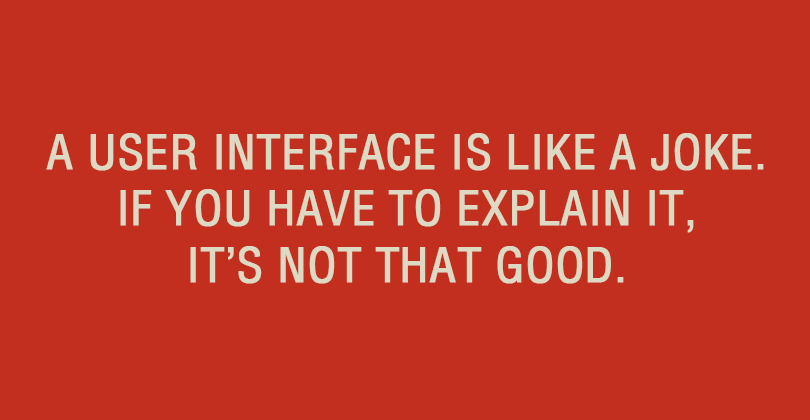

## Web Dev Revelation

Recently introduced to the Semantic UI framework, my world has changed with regards to the way I view web development. Prior to this week, I had only basic knowledge of writing HTML markups and CSS stylesheets. My simple web pages were simply boring and ugly.  I never thought I had the creative mind or patience to design great-looking user interfaces. Formatting images, text, and objects like menus were difficult and inconsistent. However, once I learned the basics of Semantic UI, my web pages were immediately looking better than before. This is not to say that Semantic UI is easy to master in a week.  There is a learning curve that requires a lot of time, experimenting, and googling in order to figure out how to use and maximize power of a UI framework like Semantic UI.

## You Reap What You Sow

Although learning to use Semantic UI takes lots of time, effort, and moments of frustration, I can already see the software engineering benefits that this type of framework provides. Over the past week, I was able to put my Semantic UI knowledge to the test by re-creating the look and feel of a few actual websites. Throughout the process, there have been times when I was stuck. Whether it was not being able to properly format an image, align text, or space out elements, there were many roadblocks I had to overcome. However, because of these obstacles, I was forced to figure out how to find, implement, and test different elements within Semantic UI through searching the web, inspecting an element, or by just experimenting with different words or combinations of words.

## Bearing Fruit in the Process

One thing I particularly enjoy about using Semantic UI is its use of common, natural language, rather than short-hand or abbreviated language. This made learning the syntax a lot easier by not having to memorize and constantly look up the proper short-hand to implement an element. However, I can see how the benefits of learning short-hand syntax can save keystrokes in the future. Since this is my first time using any type of front-end developer framework, I can't compare its usability with other competing frameworks. But one thing is clear: I will never design another user interface without the use of some sort of UI framework. I can finally say I no longer have a fear of UI design. Now, it's time we break the stereotype that developers are incapable of creating descent, if not beautiful, inviting user interfaces, one developer at a time.
