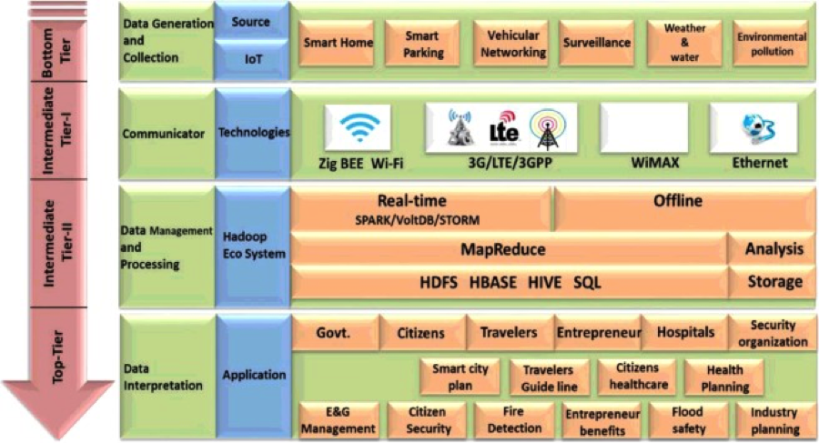

## It All Starts in Kaka'ako

Technological advancements are constantly changing the fundamental dimension of people’s lives on a daily basis.  Over just the past decade, there have been countless advances in the field of technology, and the number keeps growing, exponentially.  Technology is all around us, and there is no avoiding it.  As schools, hospitals, businesses, and citizens are keeping up with new forms of technology, it is important for urban planners and developers to also keep up with the technology and have the ability to adapt to changes in their field.  With more people using the Internet, social media websites, and smart phones more than ever before, planners have the ability to incorporate new technology in their planning to better serve the needs and wants of the community.  Specifically, planners can use informatics, data mining, and Big Data to push toward the planning of a “smart” city, which will increase functionality and sustainability, while helping to build a strongly connected community.  Honolulu is an example of a city that is currently behind as far as using technology in the field of planning.  However, if the necessary steps are taken, Honolulu can soon be transformed into a more efficient and community-oriented city.  For this to happen, the implementation of smart systems must start in a smaller radius of the city.  Kaka’ako, a district that is undergoing a lot of development currently and for the next several years, is a perfect place to start.  By creating a strongly connected district in Kaka’ako, this idea of a smart city can one day be expanded to the entire city of Honolulu.  Along with informatics and data mining, the Internet can also be used as a participation tool for citizens to contribute to the planning process.  Through online organizations, social media, and other social networks, a greater sense of community can be built.  For Kaka’ako, that sense of community is something much needed.  If planners are able to use the Internet as a tool to create discussion and opportunity, Kaka’ako will surely become the strongly connected community it desires to be.

## What is Big Data?

Before learning how informatics, data mining, and Big Data can enhance Kaka’ako, it is important to know what these terms mean.  Informatics is the science of processing data for storage and retrieval, while data mining is the process of examining this data to generate new information that can be used.  These two things work hand in hand to form what is known as Big Data, which are extremely large data sets that can be analyzed computationally to reveal patterns, trends, and associations, especially related to human behavior and interactions.  Big Data has the potential to be very useful within the field of planning, since planners can use this generated information to plan and develop projects that are based off the trends found within a targeted community.  Big Data can also be used in creating smart systems within a smart city.   A smart city is an urban development vision that incorporates information and communication technology (ICT) and uses Big Data in order to increase efficiency, sustainability, and the overall functionality of the city.  The city’s assets, such as homes, parking, traffic, and security, are enhanced and user friendly.  This technology is not only a way to save time, but also makes everyday tasks easier for citizens.

## Why Kaka'ako?

Kaka’ako has been and will continue to be a targeted area for major growth and development over the next several years.  There are currently two entities that own and oversee most of the development in Kaka’ako.  The first entity is Howard Hughes Corporation.  They manage Ward Village, a sixty-acre coastal master plan that will allow for over four thousand residences and about one million square feet of new retail (Creamer, 2012).  Many of these residences will be high-end luxury towers with a beautiful view of the ocean.  The other entity, Kamehameha Schools, oversees a project they call “Our Kaka’ako.”  This project encompasses nine blocks in Kaka’ako for a wide range of housing, green spaces, complete streets, and retail (Creamer, 2012).  The corporation expects to build condominium towers that will range from affordable rentals to luxury units.  Between these two corporations, close to thirty new condo towers are expected to be completed over the next several years.  With this revitalization of the Kaka’ako district, new development allows for complete integration and implementation of information and communication technology, along with Big Data analytics.

## The ICT Impact

Integrating information and communication technologies (ICT) into the planning process offers many opportunities and impacts.  In a journal article by Kirralie Houghton, Evonne Miller, and Marcus Foth, they discuss the use of ICT in planning and how it can better improve the process.  In the article, Houghton (2013) states, “Good places are built on understanding how people interact and experience space. There have always been layers of meaning connected to public places, specific to individual, and combined in community through shared experience and perceptions – in the age of technology there are ways to share, build and leverage these meanings and nuances of place to support and even create through a process of augmentation” (p. 4).  Different places have different meanings to people, which is often a problem many planners face when taking upon a project.  However, ICT technology allows for planners to leverage the information given to them in order to create and develop something that has meaning to the community.  A case study done in Brisbane Queensland, Australia provided a better understanding of the current relationship between planners and computing technology for urban planning.  Through three different focus groups of planners from around the area, almost none of the planners in the groups had ever used ICT in their planning practices.  In fact, the planners were generally unfamiliar to this type of technology at all.  After doing this case study, Houghton stressed the need for planners to take advantage of the technology available.  “Now is the time for planners to consider this technological sphere to utilise it to its full potential, directing that potential and staking a claim in the management of urban informatics” (Houghton, 2013, p. 12).  Like planners in Australia, planners in Honolulu and the Kaka’ako area could also benefit from integrating the use of ICT technology within their professional practices.

## It's Easy as 1, 2, 3 ... 4

Along with the use of ICT technology, Big Data analytics is another tool for planners to use in the Kaka’ako area.  With several new condominium towers being built in Kaka’ako, there will be a rapid growth in population density within the district.  This will raise the demand for various services and infrastructure to support the needs of the people moving to the area.  Big Data analytics can be utilized to improve the efficiency of Kaka’ako by initiating smart city development and planning.  In the journal article, “Urban planning and building smart cities based on the Internet of Things using Big Data analytics,” by Mazhar Rathore, Awais Ahmad, Anand Paul, and Seungmin Rho, a 4-tier architecture is proposed to implement Big Data analytics within a smart city system.  The first tier, or bottom tier, is responsible for data generation and collection.  In this tier, data gathered from various sensors placed in homes or around the city are gathered and collected.  The second tier in this architecture is comprised of the methods of communication between these sensors to the Internet.  Various technologies for this type of communication are used, including ZigBee, Wi-Fi, WiMAX, LTE, 3G, and much more (Rathore, 2016, p. 72).  The next tier is responsible for all the data managing and processing once the data reaches the Internet.  This is done using a Hadoop framework and is the main tier to this architecture.  Without this tier, the data gathered would have no meaning or use.  For data to be useful, it needs to be analyzed to form new information that can be used.  For smart city systems, all of the data processing and management is done in real-time.  In other words, it is done instantly.  The last tier is responsible for the interpretation, application, and usage of the information processed.  The government, citizens, and planners can all use the analyzed data for many applications.  For city planners, this information can be used in the planning of future projects and developments.  This 4-tier architecture is illustrated in the table provided by Rathore (2016) below.

## With Challenges Come Great Opportunity

Although this architecture for implementing Big Data analytics seems valid, this type of system does not currently exist in any city with full functionality.  As more computers, mobile devices, and embedded systems are being connected, new opportunities and challenges arise.  Massive amounts of data will be generated compared to the data generated now, so computers and other processors will have to be able to handle these large amounts of information.  Cost and efficiency would be the main challenges when implementing this data collection.  “Usually, data collection techniques are costly and difficult. Therefore, there is a need to incorporate smart technology that can efficiently and quickly collect a vast amount of data, perform analysis on Big Data, and predict the future to facilitate better planning and development” (Rathore, 2016, p. 65).  Although creating such technology is difficult, some cities are already moving in this direction to creating a smart city.  If Kaka’ako and the rest of Honolulu are able to achieve a successful system for a smart city, it will have a major impact and influence on city development on a national and global scale.  Decision-making power would be improved, as authorities would have the necessary technology and information to make quick and informative decisions.  With the overall goal to create a smart Kaka’ako, multiple networks must be installed for smart homes, smart parking, weather, traffic, pollution, and surveillance.

## Push for Smart Systems

# Homes
With close to thirty brand new condominium towers being built in Kaka’ako in the future, the perfect opportunity to install smart homes is available.  These luxury, moderate, and affordable units will have the capability to be remotely connected to.  Electronic appliances, cameras, and smoke or fire detectors will be able to be controlled and monitored by sending data generated from various sensors around the unit.  This detection will occur in real time.  For instance, if a fire is detected, an alert will be sent to both the homeowner and the nearest fire department.  Rathore (2016) also states in his journal article that, “Similar to detecting a fire in real time, electricity and gas companies effectively manage the power, gas, and water consumption to houses and different areas of the city” (p. 73).  This system will ultimately give homeowners or tenants more control and a greater sense of security for their homes.

# Parking
Parking has become a growing issue in Honolulu, as space is very limited.  Whenever a new building is built, parking must be accounted for.  With smart parking, sensors with help to track vehicles going in and out of stalls or parking zones in real-time.  “Citizens can easily obtain information on the nearest free slot of parking or more suitable places to park their vehicles” (Rathore, 2016, p. 73).  This would save a lot of time and hassle for drivers who typically struggle to find an open parking space.  Drivers would be able to use their smart phone or mobile device to locate where there are open spaces before arriving at their destination.  Some of the newer parking structures in Honolulu are already starting to move in this direction.  For example, the new parking structure in the Ala Moana Shopping Center has parking space counters, which indicate how many open stalls are available on each level of the structure.  Data and information collected from these sensors can also be analyzed and stored for later use in planning for future parking lots or structures.  Kaka’ako planners will have an easier time deciding how much parking to actually provide in the area.

# Weather
Weather and water information would also be useful for increasing the efficiency of the Kaka’ako district.  Sensors would be placed in water reservoirs or other open spaces to gather weather-related data (Rathore, 2016, p. 74).  Data relating to temperature, rain, humidity, pressure, wind speed, and water levels are all very useful for both citizens and authorities.

# Traffic
Much like parking, traffic is another major issue currently in Honolulu.  At peak traffic hours, cars can be stuck on the roads for very long periods of time.  This is why traffic information would be the most useful and important source of data within Kaka’ako.  Patterns would be formed and road blockages or accidents can be detected in real-time.  “Citizens can determine how long it will take to reach a destination based on the current intensity of traffic and the average speed of vehicles” (Rathore, 2016, p. 75).  Maps on smart phones or other mobile devices would have the ability to visually show the driver where there are traffic jams or recent accidents.  Ultimately, time will be saved for the driver.  This type of system will also reduce fuel consumption and decrease air pollution.  Since the sensors would be able to track accidents, government authorities would be quicker to respond and take action to manage the traffic.  Stoplights would also be adjusted based off the current level of traffic intensity, thereby improving the flow of traffic in certain areas during certain peak hours of the day.

# Pollution
Pollution is often an issue that is overlooked, especially in Honolulu.  However, certain gases can be dangerous when they reach certain levels.  Sensors around the streets in Kaka’ako would be able to collect data on these environmental gases, such as particular metals, carbon monoxide sulfur dioxide, ozone, and also noise (Rathore, 2016, p.76).  According to Rathore (2016), “These gases are very dangerous to human health and can cause liver disorders, coughing, and heart disease.  People should not go outside when these gases are at high levels in the environment, especially children, the elderly, those who are engaging in physical exercise, or the sick” (p. 76).  Citizens would be warned when it is dangerous to be outside when the sensors detect a certain amount of a gas that passes a particular threshold.  This type of technology will increase the level of safety within Kaka’ako and allow people to feel safer when coming into the area.

# Surveillance
Another way for citizens to feel safer is to increase the surveillance security in Kaka’ako.  This could be done through continuous video monitoring of the entire neighborhood.  However, it would be challenging and unrealistic to constantly monitor and analyze every camera throughout the district to detect crimes. To over come this, Rathore (2016) proposes a system to target specific locations.  “We propose new scenarios that increase the entire city's security system. We placed various emergency buttons, including microphones, in various places with surveillance cameras. When any crime occurs, such as a robbery, a car or purse being stolen, a fight, or illegal activity, a witness can push the emergency button, and it will send a message to the nearest police station. Thus, police or security agencies can start monitoring nearby locations through surveillance cameras and can easily locate the perpetrator” (p. 78).  Of course, this system would be an alternative to calling 911, but it could also prove to be faster and much easier.

## Getting the People Involved

Previously, the use of information and communication technology (ICT) was explained in the field of planning.  There is another form of technology related to ICT, called community informatics (CI).  CI is much like ICT, except it is very community-oriented.  In the journal article, “Community Informatics and the New Urbanism: Incorporating Information and Communication Technologies into Planning Integrated Urban Communities,” by Yongjun and Dong-Hee Shin, the concept, Community Informatics-Supported New Urbanism (CI-NU), is presented.  CI-NU, according to Shin (2012), “suggests ways of collaboration between community informatics practitioners and new urbanists to accomplish their shared goals of integrated community development” (p. 23).  This concept suggests how a community has the ability to take part in the planning process, which directly leads to community-based urban design and development.  Studies have shown that by providing homes and families with Internet and online services, there were improvements in social interactions among the community.  One study done in Netville, a suburban development in Toronto, showed how encouraging Internet and use of technology sparked connections among residents in the community.  Residents were given free high-speed Internet service, phones, online healthcare services, discussion forums, and online entertainment and educational applications (Shin, 2012, p. 35).  After experimenting with this model of a network society, they saw a greater connection between people of the community.  “The Netville experiment indicates that the wired residents of Netville, compared to non-Internet users, recognized three times as many of their neighbors, talked to those neighbors twice as often, visited them 50 percent more often, made four times as many local phone calls, and further boosted their local communication with their neighbors through online exchanges” (Rathore, 2012, p. 35).  This study shows that the development of ICTs and CIs has the ability to foster a community-oriented city.  Urban planners, including the ones in Kaka’ako, can use this method of CI within their own planning practice to encourage quality social interactions and healthy community life.  Shin (2012) also suggests in the article that planners and CI researchers “need to consider two important issues in their collaborations: (1) quality social interactions among community members and (2) the development of a deliberative participatory planning process. By so doing, CI-NU projects will demonstrate how technological innovation can contribute to building an integrated community from a normative perspective of technology and urban planning” (p. 37).  Participatory planning allows for members of the community to directly express their opinions and offer suggestions to planning projects.  The Internet provides a perfect medium for this to happen, which will be discussed next.

The use of data mining and the Internet will not be limited to real-time analyzing of data for smart cities or the use of community informatics.  Urban planners and developers can use the Internet for other uses.  Specifically, the Internet may be used as a tool to encourage and facilitate online community participation in the planning process for Kaka’ako.  Interactive and networked environments online can speed up decision-making in the planning process.  Jennifer Evans-Cowley and Justin Hollander’s article, “The New Generation of Public Participation: Internet-based Participation Tools,” discusses the advantages of using social networking and virtual reality tools to facilitate community discussion.  Online discussion forums and groups allow for thousands of people to collaborate without physically having to meet with each other.  However, different studies have shown that some forms of Internet use are more effective than others.  Two case studies were done to illustrate the use of Facebook as a means for community discussion.  One study was done with a government-initiated group, while the other was a citizen-initiated group.  The government-initiated group, in Aspen, Colorado, decided to use the Facebook group to spread information about upcoming citizen meetings.  “Although the use of the online participation tools allowed the city to enhance the participation experience for their citizens, it believes that online participation tools are most useful as a supplement to traditional participation approaches” (Evans-Cowley, 2010, p. 401).  In other words, they believed that the online participation tools would not be sufficient enough on its own to facilitate community discussion.  However, in the citizen-initiated social network, held in Austin, Texas, many users joined the group who was opposing a development plan at the time.  In fact, most groups that are formed online are created to oppose some sort of proposal or plan (Evans-Cowley, 2010, p. 401).  Many of these groups are not able to convert any plans from going through, but the potential is still there.  As more people are using the Internet as a way to raise awareness or fight a cause, planners need to be able to adapt and engage with the public themselves.  This form of communication must operate both ways.  Members of these organizations must have the ability to express their concerns to local officials, which will allow the local officials to directly address these concerns, using the Internet as a tool.

The Internet also provides greater opportunity for young people to assist in urban planning efforts.  Young people’s opinion is often overlooked in any practice.  However, Liisa Horelli and Mirkka Kaaja’s article, “Opportunities and Constraints of ‘Internet-Assisted Urban Planning’ With Young People,” argues that young people are actually sharp analysts of their setting and are creative producers.  However, it usually takes a while for authorities to be convinced that young people could actually successfully contribute to the planning process.  As far as transforming Kaka’ako into an area of innovative and technology-enhanced development, young people may take a larger role in planning such development.  “The readiness to participate in planning activities varied among the children and young people, but the young seem to be more ready than adults to adopt this new device even in planning. In a recent study concerning the use of the mobile phone and the internet by 16-18 old young people in Finland indicates that young people are very fluent in the use of several ICT-devices and they know which device to use for which purpose” (Horelli, 2002, p. 194).  With their knowledge of new technology, young people could play a key role in developing Kaka’ako and the rest of Honolulu into a smart city.

## Setting a Standard

There are many ways for new technology and the expanding Internet to help with urban planning and development.  Informatics, data mining, Big Data, information and communication technology, community informatics, and Internet participatory tools all have the ability to play a big role in creating smart cities that are efficient, functional, sustainable, and community-oriented.  This use of new technology and the Internet in Kaka’ako is just a building block to making a smarter and more efficient Honolulu.  With this opportunity to innovate, Honolulu could have a lasting impact and influence for many other cities in the world of urban planning.

## Bibliography

Creamer, B. (2012, September). Kakaako’s Building Boom. Retrieved October 25, 2016,
	from http://www.hawaiibusiness.com/kakaakos-building-boom/

Evans-Cowley, J., & Hollander, J. (2010). The New Generation of Public Participation:
Internet-based Participation Tools. Planning Practice & Research, 25(3), 397-408. doi:10.1080/02697459.2010.503432

Horelli, L., & Kaaja, M. (2002). Opportunities and Constraints of ‘Internet-Assisted
Urban Planning’ With Young People. Journal of Environmental Psychology, 22(1-2), 191-200. doi:10.1006/jevp.2001.0246

Houghton, K., Miller, E., & Foth, M. (2013). Integrating ICT into the planning process:
impacts, opportunities and challenges. Australian Planner, 51(1), 24-33. doi:10.1080/07293682.2013.770771

Rathore, M., Ahmad, A., Paul, A., & Rho, S. (2016). Urban planning and building smart
cities based on the Internet of Things using Big Data analytics. Computer Networks, 101(1), 63-80. doi:10.1016/ j.comnet.2015.12.023

Shin, Y., & Shin, D. (2012). Community Informatics and the New Urbanism:
Incorporating Information and Communication Technologies into Planning Integrated Urban Communities. Journal Of Urban Technology, 19(1), 23-42. doi:10.1080/10630732.2012.626698
