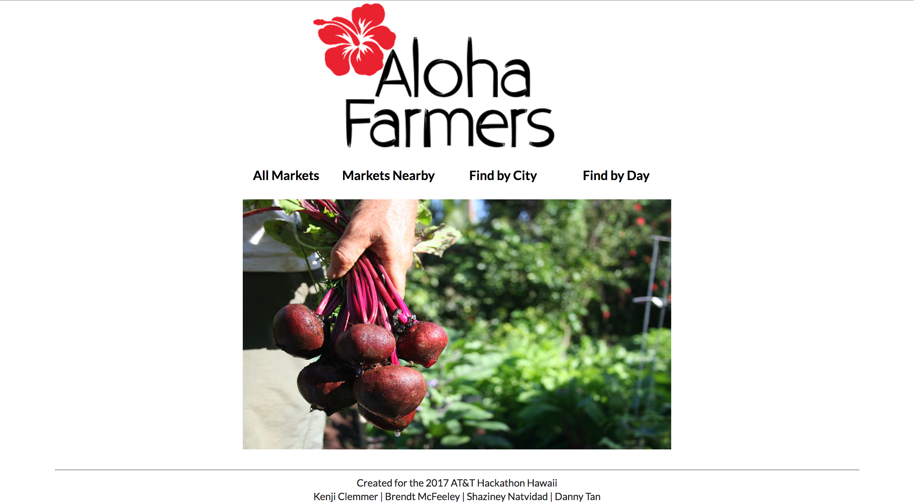

Recently I participated in the annual AT&T Hackathon here in Honolulu, HI. I was able to meet some new people and join a make-shift team of some other students from the UH Manoa ICS department. In the beginning, we had 4 people and a couple of ideas. After the next 24 hours, we had a working web app and built great relationships within our team.

Our web app is called 'Aloha Farmers', a tool for locals or visitors of the islands of Hawaii to find and talk about the farmers markets near them. We used part of the farmers market database provided by Hawaii Open Data to provide information about these farmers market in a presentable and visually appealing way. Most people know of a few farmers markets on the islands, but there are much more that most people will never know about. As a team, we felt it is important for these local farmers and small business owners to get exposure. We created this app to encourage people to support local in an effort to stimulate the local economy and promote a healthy lifestyle.

Aside from the home page, we created four separate pages within our app. The first is an 'All Markets' page, where the user can scroll through every farmers market in the database. The 'Markets Nearby' page allows the user to enter an address, zip code, city, or general location. Once this is entered, a map will appear locating all the farmers markets within a 7 mile radius of the location entered. This was the most challenging part of out app to implement. We quickly found out how difficult it is to use the Google Maps API and geolocation, but it was all worth it once we got it to work. The last two pages, the 'Find by City' and 'Find by Day' pages, filter the farmers markets shown by either the city in which it is located or by the day on which it occurs.

We used the Meteor framework along with JavaScript, HTML5, CSS, and Semantic UI within the IntelliJ IDEA integrated development environment in order to create our app. Below are some screenshots of what the UI looks like for the 'All Markets' page and the 'Markets Nearby' page.

## All Markets Page

 
## Markets Nearby Page

Overall, participating in this hackathon was a great learning experience. Although our team did not win, I was able to use what I learned about application development this semester and challenge myself to push past the basics and utilize other resources to create something I can be proud of.
