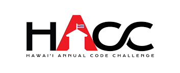
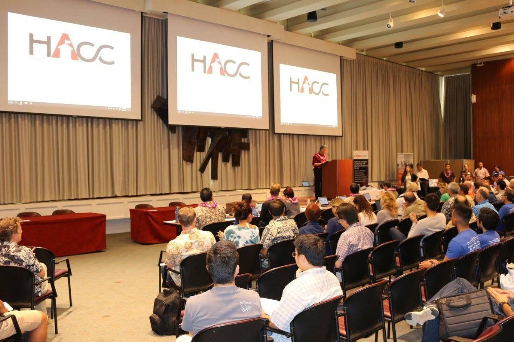
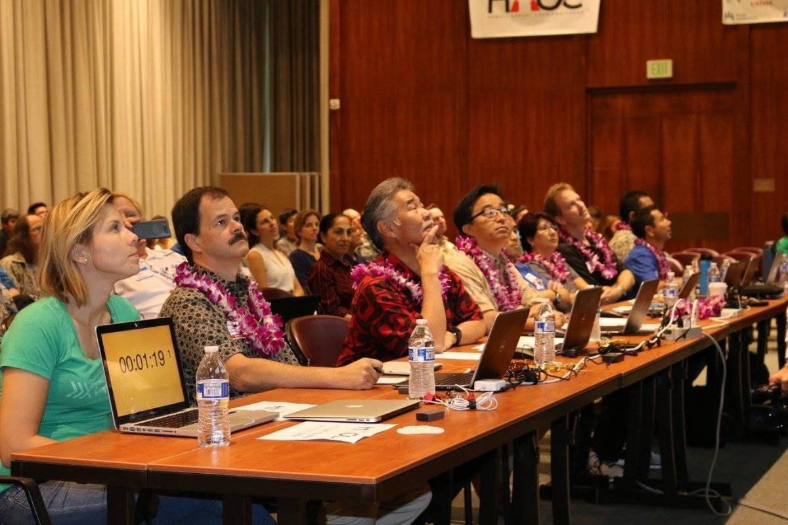
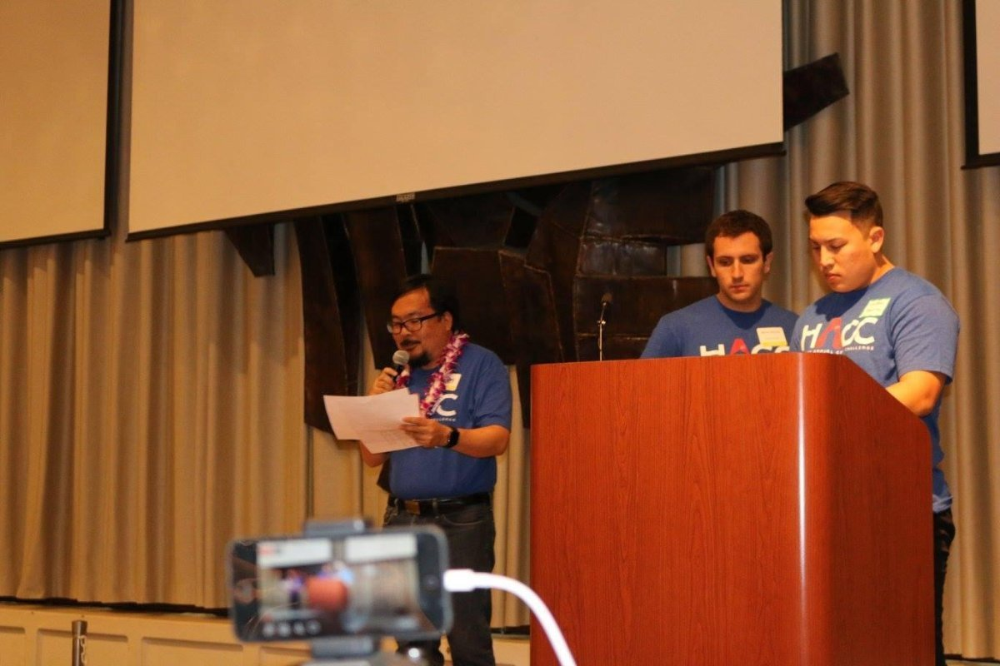
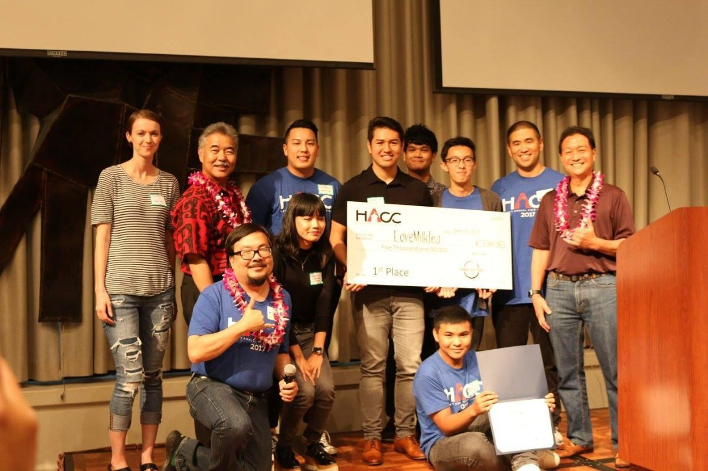

What does it mean to be a student? Is it someone who is enrolled in some kind of class?  Or maybe it’s someone who is constantly making an effort to learn and grow.  As a student, I’d like to think of myself as the latter.  What I learn in the classroom is useful, but what I can learn outside of the classroom can many times be even more rewarding.

This past September, I participated in the 2017 Hawaii Annual Code Challenge (HACC), the second annual month-long hackathon put on by Governor David Ige and the State of Hawaii.  Challenges for finding technical solutions for state issues were given at the hackthon’s kickoff event, which gave participants the opportunity to form teams and choose a challenge to take on. I ended up forming a team of seven fellow UH Manoa computer science majors. We chose to take on the challenge to build a mobile app to help new students and visitors navigate around the UH Manoa campus. We met 2-3 times a week over the course of the month, and put in countless hours on our own time to produce the best solution we could. 

One of the hardest parts of developing the app was actually getting started. Choosing the technology stack, design/functions of our app, and timeline of the project was a daunting task. There was a lot of discussion and planning that went into the project before even writing a single line of code. 

Because of the hackathon rules, there was a code freeze for technical reviewing of the code a week before the demo day, which left us with only three weeks for actual development. Day by day, we made progress on our app - adding features, functionality, and trying to make it pretty. After the code freeze, we focused on our demo presentation and video for the final week. 

 

Demo day.  The day was finally here. Over twenty teams of professionals, students, and hobbyists came to present what they worked on for the past month.  After each team gave their demo of their solutions, a panel of nine judges took the time to choose their top picks.  Our team, LoveMilkTea, took home first place overall.  As thankful as we were to see our hard work recognized with a sizable check, that wasn’t the real reward for me.  The overall experience made participating in this event worth it.  

There were a few key things that I learned throughout this experience:
1.	Teamwork.  I saw first hand both the struggles and benefits of working on a team.  I learned that communication is key when working as a team.  As students, we knew we didn't have the talent and experience compared to most other teams, so we used the power of teamwork.  We all had different strengths, but we all had the same determination.  We were able to successfully combine our strengths and drive our project through constant and open communication.
2.	Passion brings excellence.  I have worked on other software projects before, but it wasn’t until this project that I felt a true passion for what I was developing.  I found myself giving up sleep to code, not because I felt like I had to, but because I wanted to.  With this passion brought a drive to produce the best product we possibly could given our knowledge and skillset.
3.	Get uncomfortable.  Before participating in the HACC, I had my doubts.  I thought I wouldn’t have the necessary skills to really be able to compete or contribute to a team.  This being only my second hackathon, I honestly never imagined placing first in the biggest hackthon in Hawaii.  However, all this aside, I made the decision to step out of my comfort zone and put myself out there.  In a way, I was forcing myself to learn as a student of my craft.  It is through these uncomfortable and intimidating experiences that I will continue to grow as a software developer, leader, and person.

For more information about the HACC, click <a href="http://hacc.hawaii.gov/">here</a>.

To view our demo, along with the rest of the event’s submissions, click <a href="https://devpost.com/software/ho-okele">here</a>.

As a team, we also chose to continue building our app, so hopefully one day it can be used by real students and visitors of the UH Manoa campus.  Feel free to follow our project on github <a href="https://github.com/LoveMilkTea/Wayfinder">here</a>.
