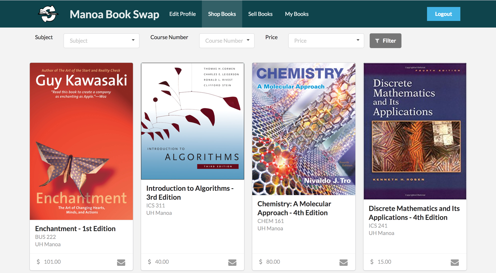
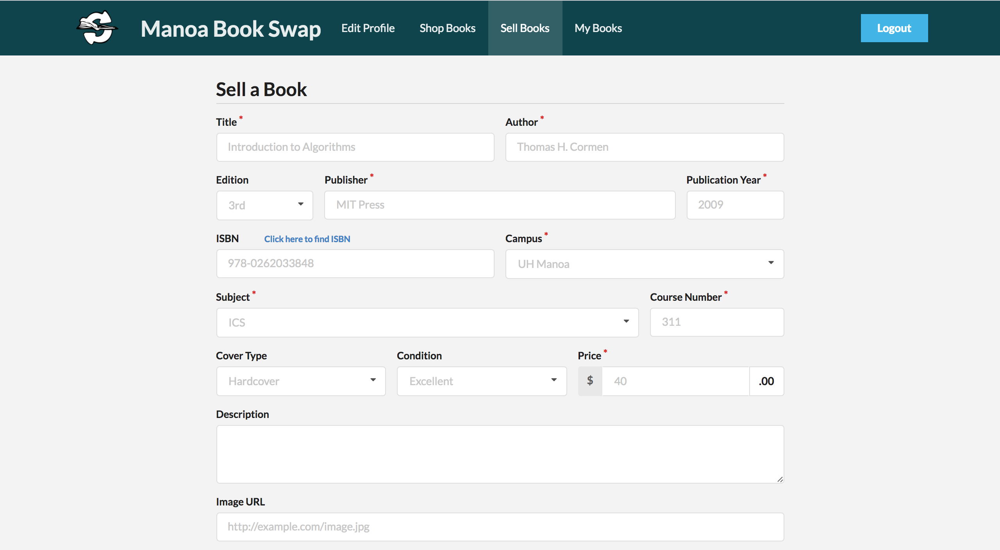
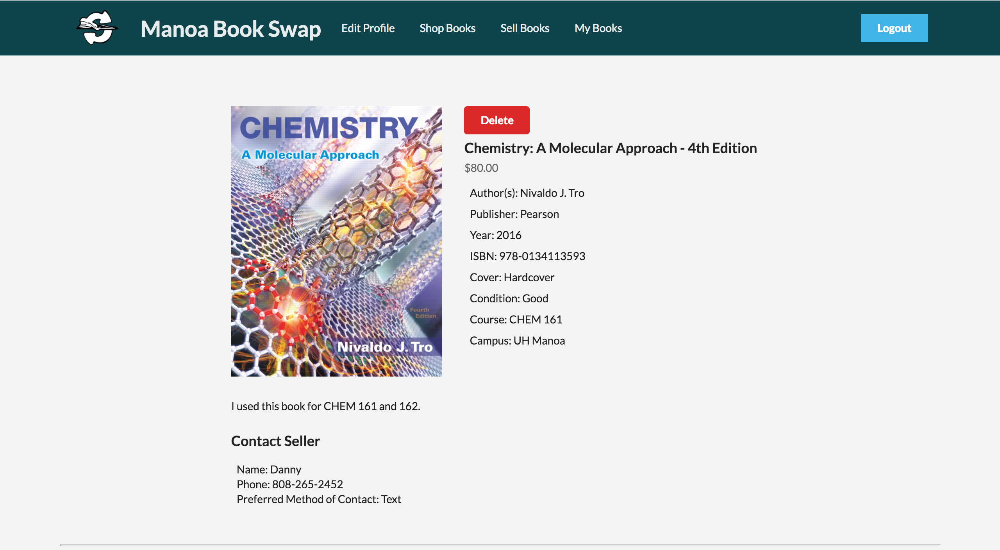

Tuition is high enough and students shouldn't have to spend a fortune on a brand new textbook that they will use for only a few months. Manoa Book Swap is a web application that allows UH students to buy and sell used textbooks with each other. This application was created as a project in ICS 314 at the University of Hawaii at Manoa by Kenji Clemmer, Brandon Ganeko, Charles Pak, and myself.  

Users are authenticated using their UH username and password, which gives them access to the site. Once given access, the user may immediately post a book to sell or view the current books available for purchase. If the user is interested in purchasing the book, they may click on it to view a full description of the book along with the seller's contact information. The user can also view all of their personal posts on the 'My Books' page. We wanted to make the application simple for the user to use by having all the main functions of the app accessible through the menu bar.

We used the Meteor framework along with JavaScript, HTML5, CSS, and Semantic UI within the IntelliJ IDEA integrated development environment in order to create our app. Below are some screenshots of what the UI looks like for the 'All Books' page, the 'Sell Books' page, and the description page.

## All Books Page

 
## Sell Books Page

 
## Description Page

I was responsible for the design of the landing page, the 'Sell Books' page, the 'Edit Profile' page, each individual card for each books, and the description page. I also implemented the Books collection and form submission for the 'Sell Books' page. A special thanks to Keola Tan who designed the logo for our application.

I learned a lot through this project. I developed technical skills with Meteor, Javascript, and Semantic UI.  I also learned how to use git and Github to manage a project between multiple contributors. Most of all, I learned how to develop as a group. Throughout the duration of this project, our group began to realize what methods of developing worked and what didn't work. At times, we were stuck as a group, forcing us to throw away some code and start over. Many times I was stuck individually, and someone from our group would make a suggestion to fix that error. I really learned how to use my group members and outside resources to push past a roadblock. The satisfaction of fixing an error or figuring something out makes it all worth it.  Overall, I enjoyed doing this project and plan on further improving the application over the next few months.

To learn more about Manoa Book Swap and its development, follow our GitHub page <a href="https://manoabookswap.github.io/">here</a>.
