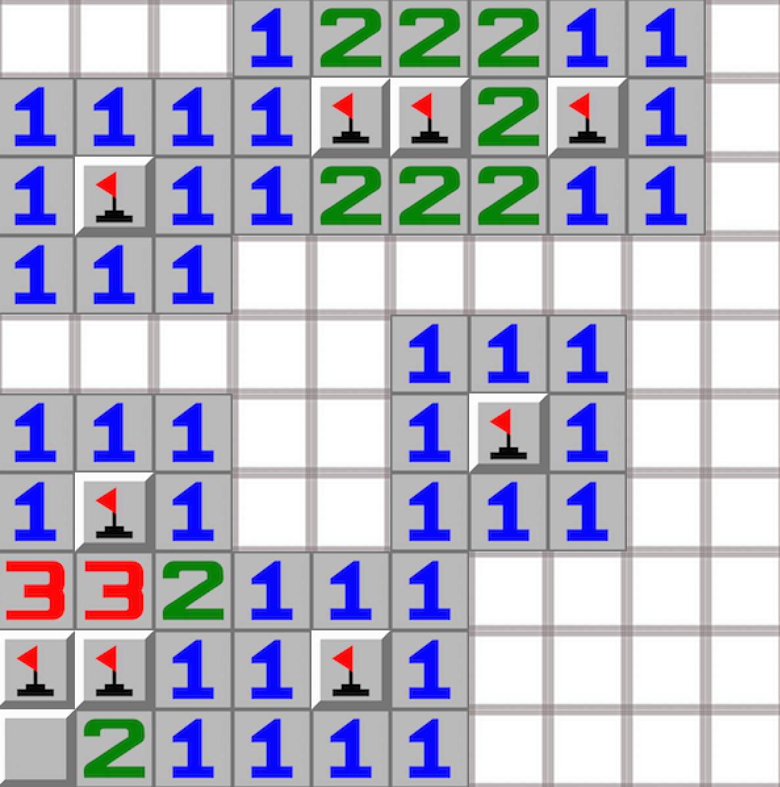
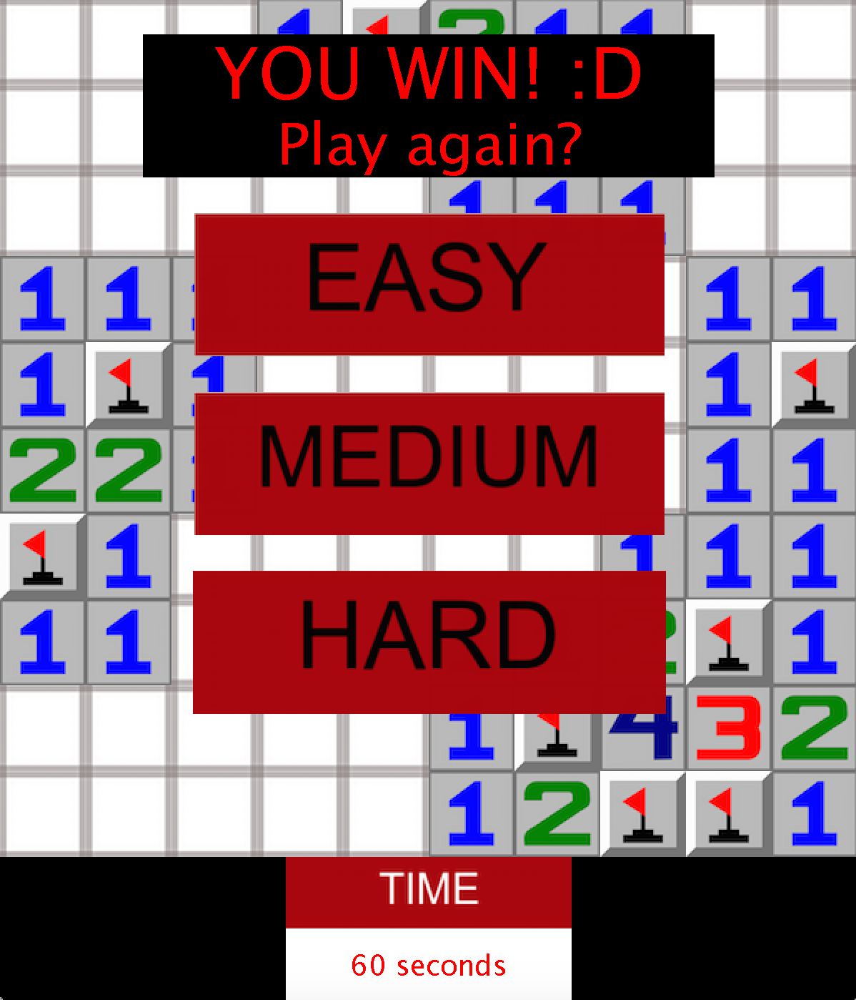
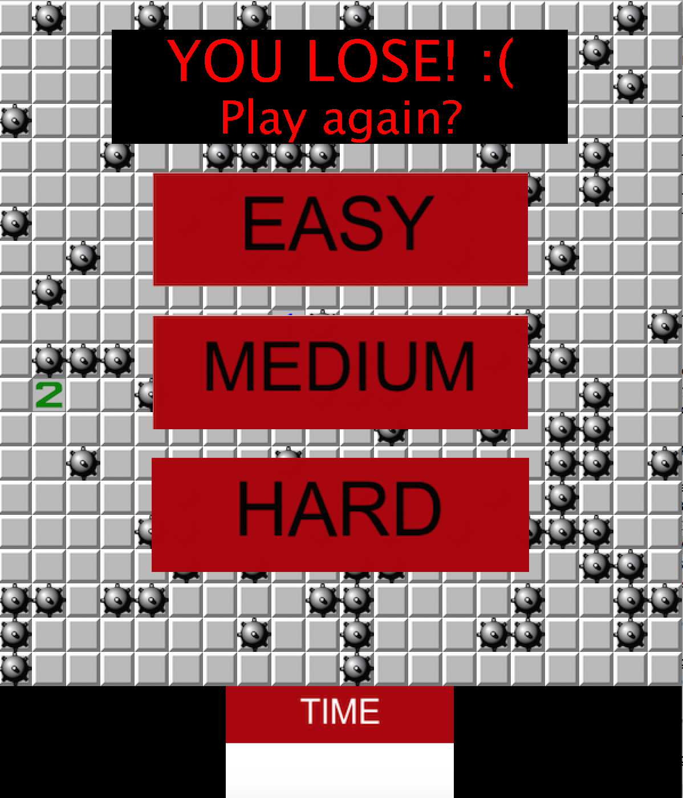

This program was developed for my ICS 211 class at the University of Hawaii as the final project for the course. I worked individually to design, implement, and test the game. Various data structures learned in the class was used to produce this game. EZ Graphics was used to design the layout for this version of Minesweeper.

The game includes three levels of difficulty: easy, medium, and hard.  When the easy mode is selected, the user is presented with a 10x10 grid. The medium mode is played with a 15x15 grid, and the hard mode is played with a 20x20 grid. There is a "start over" option which allows the player to restart if necessary. If the player wins, their time is recorded and displayed.  There is also a highscore list for each difficulty.  After each game, the player is asked if he/she wants to play again.

This project really challenged me as a programmer. I found myself struggling with "coding block" multiple times and learned that overcoming those blocks, ironically, involves taking time away from the project. Throughout the process of implementing each class and function, I often thought I would never get past the current problem. However, as I pushed forward and intensified by focus level, I was able to overcome each hurdle. After countless hours and a few nights without sleep, the end result was a feeling of satisfaction and relief that made me realize that every struggle as a programmer is worth the battle.

