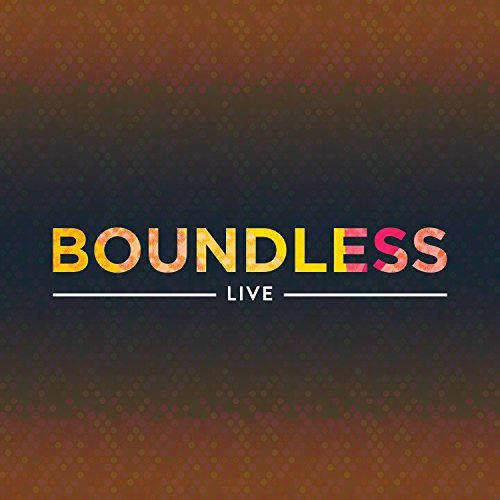

Boundless is a Christian Rock EP Album written and arranged by the Impact Fellowship worship band. All three songs were recorded in a live setting and produced by Zeo Music Studio. I was responsible for arranging and performing the drum parts, and also helped in the lyric writing process. 

These songs were created and released to share how music can be a tool to restore, heal, and connect people to God in their own way. The heart behind every word and melody is a testament to the faithfulness and goodness of the Lord, and is intended for both believers and non-believers to use to find purpose for their life.

Boundless can be found on multiple platforms, including <a href="https://itunes.apple.com/us/album/boundless-live-live-single/id1174137048">iTunes</a>, <a href="https://www.amazon.com/Boundless-Live-Impact-Fellowship/dp/B01N3PSPEA">Amazon</a>, and <a href="https://play.spotify.com/album/7aMuq6O6XAVw2JPySFcfcO?play=true&utm_source=open.spotify.com&utm_medium=open">Spotify</a>.

