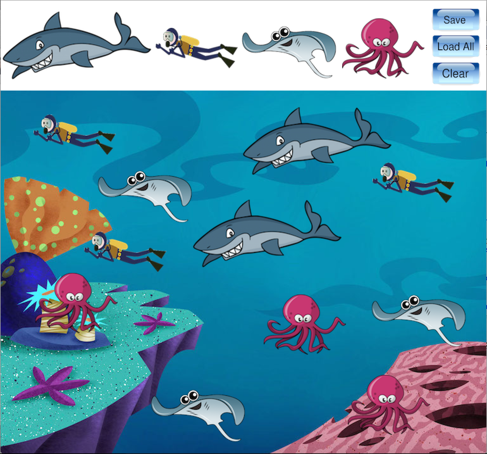

This sticker book was designed and implemented using Java and EZ Graphics (created by Dylan Kobayashi). The user is given four different sticker options to paste on the background. Each sticker can be pasted multiple times, moved, and removed from the screen. There are also the options to save the current screen, load a previously saved screen, and clear the screen. This project was done to practice simple GUI design and Java implementation.

This sticker book was the first project I have ever done in Java. Although simple, I found the programming process extremely fun and enjoyable. Yes, I did have errors along the way, but these errors forced me to become both a problem solver and a critical thinker. By completing this project, I learned that being a computer programmer doesn't just mean knowing the syntax for multiple langauges. Being a programmer means being able to be creative, solve problems, and using the computer as a tool to make life easier for others.

A demonstration is given in this <a href="https://www.youtube.com/watch?v=I9EgOSseWRY">YouTube video.</a>

